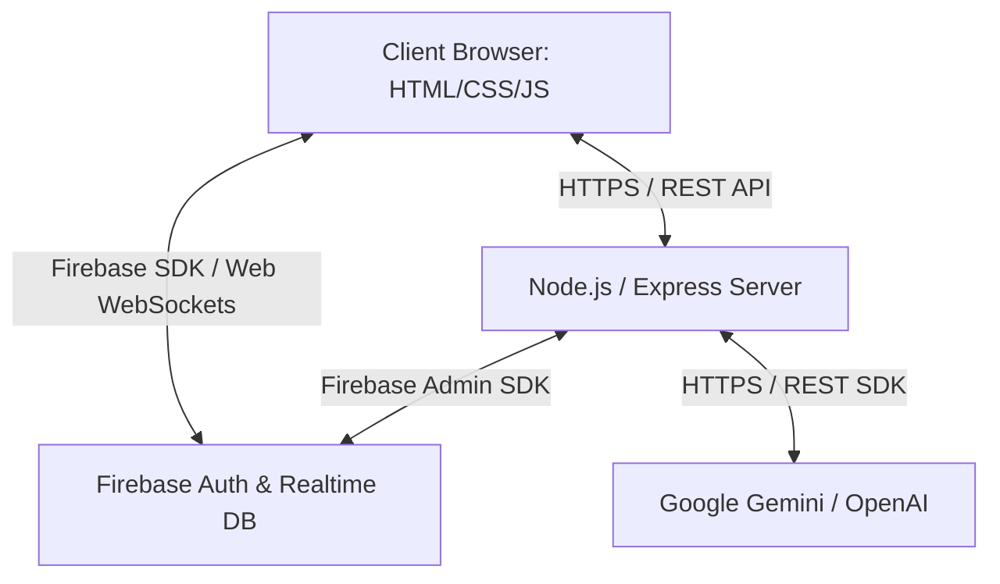
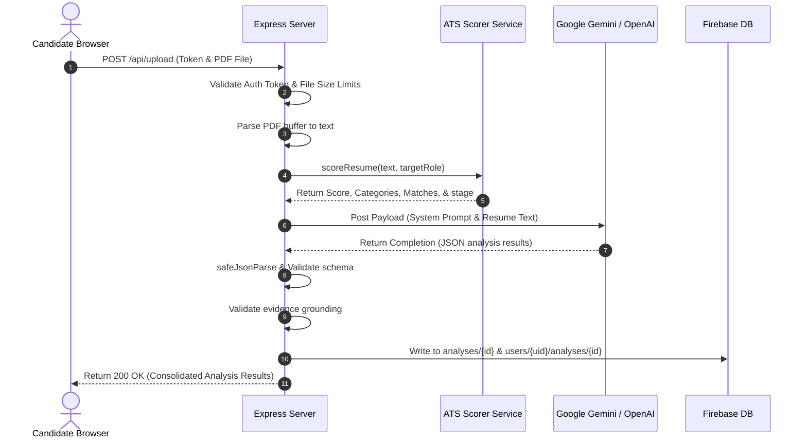
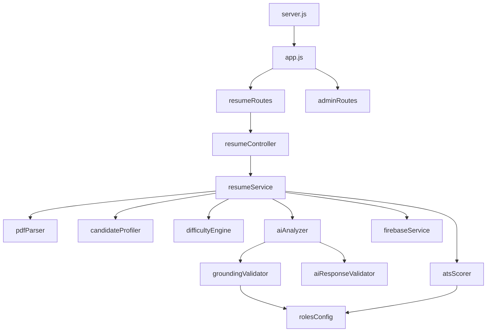

# Resumetrices Project Architecture Documentation
*Single Source of Truth for System Architecture, Pipelines, and Data Flow*

---

## SECTION 1 — Project Overview

### Project Purpose
Resumetrices is an advanced, production-grade, target-role-driven AI Resume Analyzer. It allows candidates to upload their PDF resumes and receive a highly granular, quantitative evaluation against specific target industry roles. The system validates contact details, layout formatting, tech stack keywords, work history impact metrics, project complexity, and educational credentials. Using LLM models and rule-based static evaluation engines, it produces evidence-grounded feedback, skill gap analysis, interactive interview preparation, and custom learning roadmaps.

### High-Level Architecture
The application uses a decoupled client-server architecture:
*   **Frontend**: A Single Page Application (SPA) style interface built with semantic HTML5, custom vanilla CSS3 components, and vanilla ES6 JavaScript. It communicates with the backend via REST APIs and interfaces directly with Firebase client SDKs for authentication and auth state propagation.
*   **Backend**: An Express.js REST API server built on Node.js. It manages file parsing, contains the deterministic ATS scoring engine, manages AI analysis prompt generation and API failovers, validates evidence grounding, and exposes secure admin controls.
*   **Database**: Firebase Realtime Database (RTDB) utilized in a denormalized, flat structure to achieve low-latency document reads and writes.
*   **AI Integration**: Google Gemini and OpenAI API integration featuring fallback model pipelines, dynamic retries, token limit safeguards, and verbatim grounding validators.
*   **Authentication**: Firebase Authentication manages user login, registration, password resets, and session validation. Custom middlewares inspect verified Firebase ID tokens on the server.



### Technologies Used
| Component | Stack | Libraries / APIs |
| :--- | :--- | :--- |
| **Frontend** | HTML5, CSS3, JavaScript (ES6) | Firebase Client SDK, Google Fonts (Outfit, Inter) |
| **Backend** | Node.js, Express.js | Multer, pdf-parse, Helmet, CORS |
| **Database** | Firebase Realtime Database | firebase-admin/database |
| **Authentication** | Firebase Auth | firebase-admin/auth |
| **AI Processing** | LLM Pipelines | Native SDKs (Google Gemini & OpenAI GPT) |
| **Testing** | Node.js Unit Testing | custom mock scripts, Assert |

---

## SECTION 2 — Complete Folder Structure

```
c:/CODING/Resume Analyser-2/
├── client/                     # Frontend Client Application
│   ├── admin/                  # Administrative Views
│   │   └── dashboard.html      # Admin Dashboard (Quota/Maintenance/Reports)
│   ├── css/                    # Modular Style Sheets
│   │   ├── admin.css           # Styling for Admin Views
│   │   ├── analysis.css        # Styling for Resume Analysis Report Cards
│   │   ├── base.css            # Base Styles (Reset, CSS variables, Layouts)
│   │   ├── components.css      # Reusable Components (Buttons, Inputs, Modals)
│   │   ├── dashboard.css       # User Dashboard Page Styles
│   │   ├── interview.css       # Interactive Interview Simulator Cards
│   │   ├── layout.css          # Page Containers, Sidebars, Headers
│   │   ├── profile.css         # Profile Settings Details Form Styles
│   │   ├── responsive.css      # Media Queries & Mobile Viewports
│   │   ├── roadmap.css         # Career Path Roadmap Visual Timeline CSS
│   │   ├── settings.css        # Maintenance & Options Panels Layout
│   │   ├── skill-gap.css       # Skill Gap Table & Progression Chart Layout
│   │   └── style.css           # Landing Page Visual CSS
│   ├── js/                     # Client JavaScript Modules
│   │   ├── admin.js            # Legacy admin handler (empty/replaced by html script blocks)
│   │   ├── analysis.js         # Core Analysis Render Handler
│   │   ├── api.js              # Central HTTP Client & Shared API Services
│   │   ├── auth-guard.js       # Session Validation & Redirect Guard
│   │   ├── dashboard.js        # User Dashboard Logic
│   │   ├── firebase-config.js  # Firebase Client Initialization
│   │   ├── history.js          # History List Render Handler
│   │   ├── interview.js        # Interview Prep Simulator Engine
│   │   ├── landing.js          # Landing Page Stats Loader
│   │   ├── login.js            # Auth Login Form Handler
│   │   ├── navigation.js       # Dynamic Sidebar Injections
│   │   ├── new-analysis.js     # Upload & Process Page Loader
│   │   ├── profile.js          # Profile Settings Page Logic
│   │   ├── reports.js          # "My Reports" Support View Logic
│   │   ├── roadmap.js          # Learning Roadmap Visualizer
│   │   ├── settings.js         # User Account Purge & Settings Forms
│   │   ├── signup.js           # Account Registration Handler
│   │   ├── skill-gap.js        # Skill Gap Card Render Engine
│   │   ├── utils.js            # General Frontend Helpers (Date formats, Escaping)
│   │   └── verify-email.js     # Email Verification Redirect Logic
│   ├── analysis.html           # Full Analysis Report Page
│   ├── dashboard.html          # User Home Dashboard View
│   ├── history.html            # Completed Analyses History Log
│   ├── index.html              # Main Landing Page
│   ├── interview.html          # Interactive Interview Practice View
│   ├── login.html              # Login Credentials View
│   ├── logo.png                # Brand Logo Asset
│   ├── new-analysis.html       # Resume PDF Upload and Analyze Selector
│   ├── privacy.html            # Privacy Terms Document
│   ├── profile.html            # Profile Settings & Display Details Form
│   ├── reports.html            # User Support Issue Report Viewer
│   ├── roadmap.html            # Interactive Career Roadmap View
│   ├── settings.html           # General User Options View
│   ├── signup.html             # User Registration View
│   ├── skill-gap.html          # Technical Skill Gap Analysis View
│   ├── terms.html              # Terms of Service Document
│   └── verify-email.html       # Verify Account Instruction View
├── server/                     # Backend Server Application
│   ├── config/                 # Configuration Modules
│   │   ├── constants.js        # Centralized Limits, Weights, and Timeouts
│   │   ├── env.js              # Env Variable Parser & Validator
│   │   └── rolesConfig.js      # Target Role-Specific Skills & Custom Logic
│   ├── controllers/            # Request Routing Handlers
│   │   └── resumeController.js # Resume Pipeline Orchestrator & Support Handlers
│   ├── middleware/             # Request Interceptors
│   │   ├── adminAuth.js        # Admin Email Verification Middleware
│   │   ├── auth.js             # General Firebase Token Authorization
│   │   ├── errorHandler.js     # Express Centralized Error/Multer Handler
│   │   ├── maintenance.js      # Global App Mode Interception Block
│   │   ├── rateLimiter.js      # IP & User Endpoint Quota Enforcer
│   │   └── upload.js           # Multer Disk Buffer Validator
│   ├── routes/                 # Express API Endpoint Maps
│   │   ├── adminRoutes.js      # Administrative API Endpoints
│   │   └── resumeRoutes.js     # General User API Endpoints
│   ├── services/               # Core Logic Services
│   │   ├── aiAnalyzer.js       # Native AI Prompt Dispatch & Failover Loop
│   │   ├── aiResponseValidator.js # JSON Structural Integrity Validator
│   │   ├── atsScorer.js        # Deterministic Score Engine & Stage Safeguards
│   │   ├── candidateProfiler.js# Career Stage & Complexity Inference Engine
│   │   ├── difficultyEngine.js # Adaptive Difficulty Classification metadata
│   │   ├── firebaseService.js  # Firebase Realtime Database SDK Interface
│   │   ├── groundingValidator.js# Verbatim evidence checker for claims
│   │   ├── pdfParser.js        # PDF Buffer Text Extractor
│   │   └── resumeService.js    # Multi-Stage Analysis Orchestrator
│   ├── utils/                  # Backend Shared Helpers
│   │   ├── logger.js           # Structured System Logger
│   │   └── safeJsonParse.js    # Malformed JSON recovery & repair utility
│   ├── app.js                  # App Middleware & Security Bindings
│   └── server.js               # Entry Startup Bootstrapper & Shutdown Signal Handler
├── uploads/                    # Local Upload Buffer directory (ignored except .gitkeep)
│   └── .gitkeep
├── firebase.json               # Local firebase CLI settings
└── package.json                # Server npm dependencies list
```

---

## SECTION 3 — File Inventory

### Server Component

#### [server/server.js](file:///c:/CODING/Resume%20Analyser-2/server/server.js)
*   **Purpose**: Bootstraps the application, handles unhandled exceptions, and maps SIGTERM/SIGINT signals.
*   **Imports**: `dotenv`, `config/env`, `utils/logger`, `config/constants`, `services/firebaseService`, `app`.
*   **Exports**: None.
*   **Major Functions**: `gracefulShutdown(signal)`.
*   **Public APIs**: None (system bootstrapper).
*   **Type**: Backend | **Critical**: YES | **Safe to Modify**: CAUTION (system entry).
*   **Complexity**: Low.

#### [server/app.js](file:///c:/CODING/Resume%20Analyser-2/server/app.js)
*   **Purpose**: Configures Express, registers global middlewares (CORS delegate, Helmet, body parsers), maps client static file routing, and binds error handler.
*   **Imports**: `express`, `cors`, `helmet`, `path`, `routes/resumeRoutes`, `routes/adminRoutes`, `middleware/errorHandler`, `config/constants`, `utils/logger`, `config/env`, `middleware/maintenance`.
*   **Exports**: `app` (Express instance).
*   **Public APIs**: Maps pages `/dashboard`, `/admin/dashboard`, `/env-config.js`.
*   **Type**: Backend | **Critical**: YES | **Safe to Modify**: CAUTION (middleware configurations).
*   **Complexity**: Medium.

#### [server/config/env.js](file:///c:/CODING/Resume%20Analyser-2/server/config/env.js)
*   **Purpose**: Exposes structured environment variables with production configuration warnings.
*   **Imports**: None.
*   **Exports**: Configured environment objects (`PORT`, `NODE_ENV`, `CLIENT_URL`, `FIREBASE`, `AI`, `UPLOAD`, `IS_DEV`).
*   **Type**: Backend | **Critical**: YES | **Safe to Modify**: CAUTION.
*   **Complexity**: Low.

#### [server/config/constants.js](file:///c:/CODING/Resume%20Analyser-2/server/config/constants.js)
*   **Purpose**: Centralized storage of static constants, score weights, timeouts, and rate limits.
*   **Imports**: `config/env`.
*   **Exports**: Static configuration maps (`SCORE_WEIGHTS`, `UPLOAD`, `BODY_LIMITS`, `RATE_LIMITS`, `NATIVE_AI`, `SERVER`).
*   **Type**: Backend | **Critical**: YES | **Safe to Modify**: YES (safe modification guide).
*   **Complexity**: Low.

#### [server/config/rolesConfig.js](file:///c:/CODING/Resume%20Analyser-2/server/config/rolesConfig.js)
*   **Purpose**: Target role skill requirements database and management/creative role custom evaluators.
*   **Imports**: None.
*   **Exports**: Structured roles configurations (`rolesConfig`).
*   **Type**: Backend | **Critical**: YES | **Safe to Modify**: YES.
*   **Complexity**: Medium.

#### [server/controllers/resumeController.js](file:///c:/CODING/Resume%20Analyser-2/server/controllers/resumeController.js)
*   **Purpose**: Handles endpoint requests by connecting REST inputs to internal business logic.
*   **Imports**: `fs`, `services/firebaseService`, `services/resumeService`, `utils/logger`, `crypto`.
*   **Exports**: Request handlers (`analyzeResume`, `analyzePublicResume`, `storeAnonymousAnalysis`, `claimAnalysis`, `reportIssue`, `getUserReports`, `getPublicStats`, `getAnalysisHistory`, `getDashboardStats`, `getAnalysisById`, `deleteAnalysis`, `renameAnalysis`, `analyzeSkillGap`, `generateInterviewQuestions`, `updateUserProfile`, `deleteUserAccount`, `exportUserData`).
*   **Type**: Backend | **Critical**: YES | **Safe to Modify**: CAUTION.
*   **Complexity**: High.

#### [server/middleware/adminAuth.js](file:///c:/CODING/Resume%20Analyser-2/server/middleware/adminAuth.js)
*   **Purpose**: Restricts administrative requests based on configured admin emails.
*   **Imports**: `firebase-admin/auth`, `services/firebaseService`, `utils/logger`, `config/env`.
*   **Exports**: `requireAdmin` (middleware).
*   **Type**: Backend | **Critical**: YES | **Safe to Modify**: CAUTION.
*   **Complexity**: Low.

#### [server/middleware/auth.js](file:///c:/CODING/Resume%20Analyser-2/server/middleware/auth.js)
*   **Purpose**: Authorizes user requests via Firebase Auth ID tokens and maps local dev bypasses.
*   **Imports**: `firebase-admin/auth`, `services/firebaseService`, `utils/logger`, `config/env`.
*   **Exports**: `requireAuth` (middleware).
*   **Type**: Backend | **Critical**: YES | **Safe to Modify**: CAUTION.
*   **Complexity**: Medium.

#### [server/middleware/errorHandler.js](file:///c:/CODING/Resume%20Analyser-2/server/middleware/errorHandler.js)
*   **Purpose**: Sanitizes error trace maps and provides structured JSON error formats.
*   **Imports**: `utils/logger`, `config/env`.
*   **Exports**: `errorHandler` (middleware).
*   **Type**: Backend | **Critical**: YES | **Safe to Modify**: CAUTION.
*   **Complexity**: Medium.

#### [server/middleware/maintenance.js](file:///c:/CODING/Resume%20Analyser-2/server/middleware/maintenance.js)
*   **Purpose**: Blocks consumer traffic when system optimization mode is active.
*   **Imports**: `utils/logger`.
*   **Exports**: `maintenanceMiddleware`.
*   **Type**: Backend | **Critical**: YES | **Safe to Modify**: YES.
*   **Complexity**: Medium.

#### [server/middleware/rateLimiter.js](file:///c:/CODING/Resume%20Analyser-2/server/middleware/rateLimiter.js)
*   **Purpose**: In-memory IP and authenticated UID request quota enforcer.
*   **Imports**: `config/constants`, `utils/logger`.
*   **Exports**: `rateLimiter` (dynamic middleware factory).
*   **Type**: Backend | **Critical**: YES | **Safe to Modify**: YES.
*   **Complexity**: Medium.

#### [server/middleware/upload.js](file:///c:/CODING/Resume%20Analyser-2/server/middleware/upload.js)
*   **Purpose**: Validates uploaded file mime types, extensions, and size limits.
*   **Imports**: `multer`, `path`, `config/constants`.
*   **Exports**: Multer upload config.
*   **Type**: Backend | **Critical**: YES | **Safe to Modify**: YES.
*   **Complexity**: Low.

#### [server/routes/adminRoutes.js](file:///c:/CODING/Resume%20Analyser-2/server/routes/adminRoutes.js)
*   **Purpose**: Administrative API route definitions.
*   **Imports**: `express`, `middleware/adminAuth`, `middleware/rateLimiter`, `services/firebaseService`.
*   **Exports**: Express router.
*   **Type**: Backend | **Critical**: YES | **Safe to Modify**: YES.
*   **Complexity**: Low.

#### [server/routes/resumeRoutes.js](file:///c:/CODING/Resume%20Analyser-2/server/routes/resumeRoutes.js)
*   **Purpose**: Consumer API route definitions.
*   **Imports**: `express`, `controllers/resumeController`, `middleware/upload`, `middleware/auth`, `middleware/rateLimiter`.
*   **Exports**: Express router.
*   **Type**: Backend | **Critical**: YES | **Safe to Modify**: YES.
*   **Complexity**: Low.

#### [server/services/resumeService.js](file:///c:/CODING/Resume%20Analyser-2/server/services/resumeService.js)
*   **Purpose**: Orchestrates the multi-stage resume analysis pipeline and registers the process-wide fetch interceptor.
*   **Imports**: `fs`, `crypto`, `services/pdfParser`, `services/firebaseService`, `services/atsScorer`, `services/aiAnalyzer`, `services/candidateProfiler`, `services/difficultyEngine`, `services/aiResponseValidator`, `config/constants`, `config/env`, `utils/logger`, `utils/safeJsonParse`.
*   **Exports**: `processResumeAnalysis`.
*   **Type**: Backend | **Critical**: YES | **Safe to Modify**: CAUTION (core logic orchestrator).
*   **Complexity**: High.

#### [server/services/pdfParser.js](file:///c:/CODING/Resume%20Analyser-2/server/services/pdfParser.js)
*   **Purpose**: Parses PDF buffers to extract text.
*   **Imports**: `fs`.promises, `pdf-parse`, `utils/logger`.
*   **Exports**: `extractText`.
*   **Type**: Backend | **Critical**: YES | **Safe to Modify**: CAUTION.
*   **Complexity**: Low.

#### [server/services/atsScorer.js](file:///c:/CODING/Resume%20Analyser-2/server/services/atsScorer.js)
*   **Purpose**: Deterministic static ATS score evaluation engine.
*   **Imports**: `config/constants`, `utils/logger`, `config/rolesConfig`.
*   **Exports**: `scoreResume`.
*   **Type**: Backend | **Critical**: YES | **Safe to Modify**: DO NOT MODIFY.
*   **Complexity**: High.

#### [server/services/aiAnalyzer.js](file:///c:/CODING/Resume%20Analyser-2/server/services/aiAnalyzer.js)
*   **Purpose**: Integrates Google Gemini and OpenAI models with fallbacks, retries, and prompt construction.
*   **Imports**: `config/env`, `utils/logger`, `config/constants`, `crypto`, `services/aiResponseValidator`, `services/groundingValidator`.
*   **Exports**: `analyzeResumeText`, `analyzeSkillGap`, `generateInterviewQuestions`, `extractProjectsFromText`.
*   **Type**: Backend | **Critical**: YES | **Safe to Modify**: DO NOT MODIFY.
*   **Complexity**: High.

#### [server/services/candidateProfiler.js](file:///c:/CODING/Resume%20Analyser-2/server/services/candidateProfiler.js)
*   **Purpose**: Infers experience level, technical depth, and project complexity.
*   **Imports**: `utils/logger`.
*   **Exports**: `buildCandidateProfile`.
*   **Type**: Backend | **Critical**: YES | **Safe to Modify**: CAUTION.
*   **Complexity**: Medium.

#### [server/services/difficultyEngine.js](file:///c:/CODING/Resume%20Analyser-2/server/services/difficultyEngine.js)
*   **Purpose**: Adaptive difficulty classification and validation logic.
*   **Imports**: `utils/logger`.
*   **Exports**: `generateDifficultyMetadata`, `generateStandaloneDifficulty`.
*   **Type**: Backend | **Critical**: YES | **Safe to Modify**: CAUTION.
*   **Complexity**: Medium.

#### [server/services/groundingValidator.js](file:///c:/CODING/Resume%20Analyser-2/server/services/groundingValidator.js)
*   **Purpose**: Validates AI claims against verbatim resume texts.
*   **Imports**: `utils/logger`, `config/rolesConfig`.
*   **Exports**: `validateAtsAnalysis`, `validateSkillGap`, `validateInterviewQuestions`.
*   **Type**: Backend | **Critical**: YES | **Safe to Modify**: CAUTION.
*   **Complexity**: Medium.

#### [server/services/aiResponseValidator.js](file:///c:/CODING/Resume%20Analyser-2/server/services/aiResponseValidator.js)
*   **Purpose**: Performs structural, type, and domain score validation of LLM outputs.
*   **Imports**: `utils/logger`.
*   **Exports**: `validateAtsAnalysis`, `validateSkillGap`, `validateInterviewQuestions`, `validateConsolidatedRecord`.
*   **Type**: Backend | **Critical**: YES | **Safe to Modify**: CAUTION.
*   **Complexity**: Medium.

#### [server/services/firebaseService.js](file:///c:/CODING/Resume%20Analyser-2/server/services/firebaseService.js)
*   **Purpose**: Exposes interface calls to Firebase Auth and RTDB.
*   **Imports**: `firebase-admin`, `firebase-admin/database`, `utils/logger`, `config/env`.
*   **Exports**: Realtime Database APIs and initialization statuses.
*   **Type**: Backend | **Critical**: YES | **Safe to Modify**: CAUTION.
*   **Complexity**: High.

#### [server/utils/logger.js](file:///c:/CODING/Resume%20Analyser-2/server/utils/logger.js)
*   **Purpose**: Standard console logger with timestamp and level metadata.
*   **Imports**: None.
*   **Exports**: Log formatting helpers (`info`, `warn`, `error`).
*   **Type**: Backend | **Critical**: YES | **Safe to Modify**: YES.
*   **Complexity**: Low.

#### [server/utils/safeJsonParse.js](file:///c:/CODING/Resume%20Analyser-2/server/utils/safeJsonParse.js)
*   **Purpose**: Corrects and extracts JSON from malformed LLM completions.
*   **Imports**: None.
*   **Exports**: `safeJsonParse` utility.
*   **Type**: Backend | **Critical**: YES | **Safe to Modify**: YES.
*   **Complexity**: Low.

---

### Client Component

#### [client/js/firebase-config.js](file:///c:/CODING/Resume%20Analyser-2/client/js/firebase-config.js)
*   **Purpose**: Loads and instantiates the client-side Firebase Auth and Database SDKs.
*   **Imports**: None (loads global CDN modules).
*   **Exports**: Firebase instances (`db`, `auth`, `provider`).
*   **Type**: Frontend | **Critical**: YES | **Safe to Modify**: CAUTION.
*   **Complexity**: Low.

#### [client/js/api.js](file:///c:/CODING/Resume%20Analyser-2/client/js/api.js)
*   **Purpose**: Centralizes server-side REST communication and contains base HTTP wrapper configurations.
*   **Imports**: `client/js/firebase-config.js`.
*   **Exports**: `FirebaseService` (global API client object).
*   **Type**: Frontend | **Critical**: YES | **Safe to Modify**: CAUTION.
*   **Complexity**: Medium.

#### [client/js/auth-guard.js](file:///c:/CODING/Resume%20Analyser-2/client/js/auth-guard.js)
*   **Purpose**: Protects client pages from unauthenticated visits.
*   **Imports**: `client/js/firebase-config.js`.
*   **Exports**: Redirect routines.
*   **Type**: Frontend | **Critical**: YES | **Safe to Modify**: YES.
*   **Complexity**: Low.

#### [client/js/navigation.js](file:///c:/CODING/Resume%20Analyser-2/client/js/navigation.js)
*   **Purpose**: Renders the global layout responsive sidebar, navigation menu, and user display info.
*   **Imports**: `client/js/firebase-config.js`.
*   **Exports**: Sidebar layout injection logic.
*   **Type**: Frontend | **Critical**: YES | **Safe to Modify**: YES.
*   **Complexity**: Low.

#### [client/js/utils.js](file:///c:/CODING/Resume%20Analyser-2/client/js/utils.js)
*   **Purpose**: Generic client-side functions (XSS escaping, HSL avatars, date formatting).
*   **Imports**: None.
*   **Exports**: Utility functions (`escapeHTML`, `formatDate`, `getDeterministicAvatar`).
*   **Type**: Frontend | **Critical**: YES | **Safe to Modify**: YES.
*   **Complexity**: Low.

#### [client/js/landing.js](file:///c:/CODING/Resume%20Analyser-2/client/js/landing.js)
*   **Purpose**: Fetches and renders public landing page stats.
*   **Imports**: `client/js/api.js`.
*   **Type**: Frontend | **Critical**: NO | **Safe to Modify**: YES.
*   **Complexity**: Low.

#### [client/js/login.js](file:///c:/CODING/Resume%20Analyser-2/client/js/login.js)
*   **Purpose**: Sign-in form flow handling.
*   **Imports**: `client/js/firebase-config.js`, `client/js/api.js`.
*   **Type**: Frontend | **Critical**: YES | **Safe to Modify**: YES.
*   **Complexity**: Low.

#### [client/js/signup.js](file:///c:/CODING/Resume%20Analyser-2/client/js/signup.js)
*   **Purpose**: Form submission handling for new user registrations.
*   **Imports**: `client/js/firebase-config.js`, `client/js/api.js`.
*   **Type**: Frontend | **Critical**: YES | **Safe to Modify**: YES.
*   **Complexity**: Low.

#### [client/js/dashboard.js](file:///c:/CODING/Resume%20Analyser-2/client/js/dashboard.js)
*   **Purpose**: Renders home dashboard components, metrics, and list of recent analyses.
*   **Imports**: `client/js/firebase-config.js`, `client/js/api.js`, `client/js/utils.js`.
*   **Type**: Frontend | **Critical**: YES | **Safe to Modify**: YES.
*   **Complexity**: Medium.

#### [client/js/new-analysis.js](file:///c:/CODING/Resume%20Analyser-2/client/js/new-analysis.js)
*   **Purpose**: Manages file drops, upload state, validation rules, and pipelines.
*   **Imports**: `client/js/firebase-config.js`, `client/js/api.js`.
*   **Type**: Frontend | **Critical**: YES | **Safe to Modify**: YES.
*   **Complexity**: Medium.

#### [client/js/analysis.js](file:///c:/CODING/Resume%20Analyser-2/client/js/analysis.js)
*   **Purpose**: Renders the complete, detailed resume report.
*   **Imports**: `client/js/firebase-config.js`, `client/js/api.js`, `client/js/utils.js`.
*   **Type**: Frontend | **Critical**: YES | **Safe to Modify**: YES.
*   **Complexity**: High (dynamic card rendering and collapsible layouts).

#### [client/js/skill-gap.js](file:///c:/CODING/Resume%20Analyser-2/client/js/skill-gap.js)
*   **Purpose**: Renders skill gap metrics and learning timelines.
*   **Imports**: `client/js/firebase-config.js`, `client/js/api.js`, `client/js/utils.js`.
*   **Type**: Frontend | **Critical**: NO | **Safe to Modify**: YES.
*   **Complexity**: Medium.

#### [client/js/interview.js](file:///c:/CODING/Resume%20Analyser-2/client/js/interview.js)
*   **Purpose**: Manages the interactive Q&A interview practice simulator.
*   **Imports**: `client/js/firebase-config.js`, `client/js/api.js`, `client/js/utils.js`.
*   **Type**: Frontend | **Critical**: NO | **Safe to Modify**: YES.
*   **Complexity**: Medium.

#### [client/js/roadmap.js](file:///c:/CODING/Resume%20Analyser-2/client/js/roadmap.js)
*   **Purpose**: Timeline visualizations of career learning paths.
*   **Imports**: `client/js/firebase-config.js`, `client/js/api.js`, `client/js/utils.js`.
*   **Type**: Frontend | **Critical**: NO | **Safe to Modify**: YES.
*   **Complexity**: Medium.

#### [client/js/history.js](file:///c:/CODING/Resume%20Analyser-2/client/js/history.js)
*   **Purpose**: Renders the history log of completed analyses.
*   **Imports**: `client/js/firebase-config.js`, `client/js/api.js`, `client/js/utils.js`.
*   **Type**: Frontend | **Critical**: NO | **Safe to Modify**: YES.
*   **Complexity**: Low.

#### [client/js/profile.js](file:///c:/CODING/Resume%20Analyser-2/client/js/profile.js)
*   **Purpose**: Handles updates to profile name and target domain.
*   **Imports**: `client/js/firebase-config.js`, `client/js/api.js`.
*   **Type**: Frontend | **Critical**: NO | **Safe to Modify**: YES.
*   **Complexity**: Low.

#### [client/js/reports.js](file:///c:/CODING/Resume%20Analyser-2/client/js/reports.js)
*   **Purpose**: Handles fetching and rendering user support issue reports.
*   **Imports**: `client/js/firebase-config.js`, `client/js/api.js`, `client/js/utils.js`.
*   **Type**: Frontend | **Critical**: NO | **Safe to Modify**: YES.
*   **Complexity**: Low.

#### [client/js/settings.js](file:///c:/CODING/Resume%20Analyser-2/client/js/settings.js)
*   **Purpose**: Manages global options and account deletion actions.
*   **Imports**: `client/js/firebase-config.js`, `client/js/api.js`.
*   **Type**: Frontend | **Critical**: NO | **Safe to Modify**: YES.
*   **Complexity**: Low.

---

## SECTION 4 — Frontend Architecture

The frontend is a lightweight Single Page Application-style visual layer structured around HTML templates, modular styling sheets, and module-scoped JS scripts.

### Page Profiles

| HTML Page | CSS file | JS Module | API Endpoints Used | Parent | Navigation |
| :--- | :--- | :--- | :--- | :--- | :--- |
| **Landing** (`index.html`) | `style.css` | `landing.js` | `GET /api/public/stats` | None | Public |
| **Login** (`login.html`) | `base.css` | `login.js` | Firebase Auth | Landing | Public |
| **Signup** (`signup.html`) | `base.css` | `signup.js` | Firebase Auth | Landing | Public |
| **Verify Email** (`verify-email.html`) | `base.css` | `verify-email.js` | Firebase Auth | Login | Redirect |
| **Dashboard** (`dashboard.html`) | `dashboard.css` | `dashboard.js` | `GET /api/dashboard/stats` | Login | Sidebar |
| **New Analysis** (`new-analysis.html`) | `layout.css` | `new-analysis.js` | `POST /api/upload`, `POST /api/public/analyze` | Dashboard | Sidebar |
| **Analysis** (`analysis.html`) | `analysis.css` | `analysis.js` | `GET /api/analysis/:id`, `PUT /api/analysis/:id/rename`, `DELETE /api/analysis/:id` | Dashboard | Contextual |
| **Skill Gap** (`skill-gap.html`) | `skill-gap.css` | `skill-gap.js` | `GET /api/analysis/:id`, `POST /api/skills/gap` | Dashboard | Sidebar |
| **Interview Prep** (`interview.html`) | `interview.css` | `interview.js` | `GET /api/analysis/:id`, `POST /api/interview/questions` | Dashboard | Sidebar |
| **Roadmap** (`roadmap.html`) | `roadmap.css` | `roadmap.js` | `GET /api/analysis/:id` | Dashboard | Sidebar |
| **History** (`history.html`) | `layout.css` | `history.js` | `GET /api/history` | Dashboard | Sidebar |
| **My Reports** (`reports.html`) | `layout.css` | `reports.js` | `GET /api/reports`, `POST /api/report-issue` | Dashboard | Sidebar |
| **Profile** (`profile.html`) | `profile.css` | `profile.js` | `PUT /api/user/profile` | Dashboard | Sidebar |
| **Settings** (`settings.html`) | `settings.css` | `settings.js` | `DELETE /api/user`, `GET /api/user/export` | Dashboard | Sidebar |
| **Admin Dashboard** (`admin/dashboard.html`) | `admin.css` | In-line Script | `/api/admin/*` | Dashboard | Admin-only |

### Visual Layout & CSS Framework
The application styles are built using **Vanilla CSS3** without external visual frameworks like Tailwind. It relies on a design token architecture located in [base.css](file:///c:/CODING/Resume%20Analyser-2/client/css/base.css) and [components.css](file:///c:/CODING/Resume%20Analyser-2/client/css/components.css). Themes dynamically map HSL variables (`--bg-primary`, `--text-main`, `--accent`) in response to user preference storage (`localStorage.getItem('theme')`).

---

## SECTION 5 — Backend Architecture

The backend is built as an Express.js middleware pipeline executing logic in a defined lifecycle:

```
Request 
  ↓ 
[Helmet & CORS Delegate Security] 
  ↓ 
[Rate Limiter (IP/UID)] 
  ↓ 
[Maintenance Mode Check] 
  ↓ 
[Firebase ID Token Authorization Middleware] 
  ↓ 
[Multer Upload File Validation] 
  ↓ 
[Controller Handler] 
  ↓ 
[Service Orchestration Layer] 
  ↓ 
[Global Error Handler]
```

### Components

*   **Routes**: Located in `/server/routes`, separating admin operations (`adminRoutes.js`) from consumer pipelines (`resumeRoutes.js`).
*   **Controllers**: Located in [resumeController.js](file:///c:/CODING/Resume%20Analyser-2/server/controllers/resumeController.js). Receives parsed route parameters, delegates business execution to services, and formats standard JSON client returns.
*   **Services**: Core logic engines:
    *   `pdfParser.js`: Extracts strings from binary buffers.
    *   `atsScorer.js`: Deterministic scoring rules.
    *   `candidateProfiler.js`: In-memory classification inference.
    *   `difficultyEngine.js`: Adaptive interview styling maps.
    *   `aiAnalyzer.js`: LLM integration.
    *   `groundingValidator.js` & `aiResponseValidator.js`: Output validation.
    *   `firebaseService.js`: Database operations.
*   **Middlewares**: Intercepts requests for authentication (`auth.js`), rate-limiting (`rateLimiter.js`), maintenance blocks (`maintenance.js`), and file verification (`upload.js`).
*   **Utilities**: Common helper files like `logger.js` and `safeJsonParse.js`.

---

## SECTION 6 — API Documentation

### 1. Consumer Endpoints (`/api/*`)

#### `POST /api/upload` (Alias: `/api/analyze`)
*   **Purpose**: Runs the full resume analysis pipeline.
*   **Authentication Required**: YES.
*   **Headers**: `Authorization: Bearer <Firebase_ID_Token>`
*   **Input**: Multipart Form-Data:
    *   `resume` (File, PDF format, max 5MB)
    *   `targetRole` (String, e.g. "Frontend Developer")
*   **Output (200 OK)**:
    ```json
    {
      "success": true,
      "analysisId": "string",
      "userId": "string",
      "resumeName": "string",
      "targetRole": "string",
      "score": 85,
      "breakdown": { "skills": 25, "projects": 20, "experience": 15 },
      "explanations": { "skills": "Matched 6 essential skills...", "experience": "..." },
      "strengths": ["string"],
      "weaknesses": ["string"],
      "recommendations": ["string"],
      "missingKeywords": ["string"],
      "recruiterFeedback": "string",
      "skillGap": { "matchedSkills": ["string"], "missingSkills": ["string"] },
      "interviewPrep": { "technical": [{ "question": "string" }] }
    }
    ```
*   **Errors**:
    *   `400 Bad Request` (`LIMIT_FILE_SIZE` / `MISSING_FILE` / `INVALID_FILE_TYPE`)
    *   `401 Unauthorized` (`UNAUTHORIZED` / `AUTH_FAILED`)
    *   `503 Service Unavailable` (`AI_RESPONSE_INVALID` on complete parse failure)

#### `POST /api/public/analyze`
*   **Purpose**: Guest analysis endpoint (does not require auth or persist to a user history).
*   **Authentication Required**: NO.
*   **Input**: Multipart Form-Data containing `resume` (PDF) and `targetRole` (string).
*   **Output**: Identical to `/api/upload` but `userId` is marked as `"anonymous"`.

#### `POST /api/analysis/store-anonymous`
*   **Purpose**: Temporarily saves a guest analysis to allow claiming it later.
*   **Input**: JSON: `{ "sessionId": "string", "analysisData": { ... } }`
*   **Output (200 OK)**: `{ "success": true }`

#### `POST /api/analysis/claim`
*   **Purpose**: Migrates a temporarily saved guest analysis to an authenticated user profile.
*   **Authentication Required**: YES.
*   **Input**: JSON: `{ "sessionId": "string" }`
*   **Output (200 OK)**: `{ "success": true, "analysisId": "string" }`

#### `POST /api/report-issue`
*   **Purpose**: Saves a bug/support issue report.
*   **Authentication Required**: YES.
*   **Input**: JSON: `{ "issueType": "string", "issueDescription": "string" }`
*   **Output (200 OK)**: `{ "success": true, "reportId": "string" }`

#### `GET /api/reports`
*   **Purpose**: Retrieves issue reports submitted by the logged-in user.
*   **Authentication Required**: YES.
*   **Output (200 OK)**: `{ "success": true, "reports": [...] }`

#### `GET /api/history`
*   **Purpose**: Returns the list of completed analysis summaries for the user.
*   **Authentication Required**: YES.
*   **Output (200 OK)**: `{ "success": true, "history": [...] }`

#### `GET /api/dashboard/stats`
*   **Purpose**: Returns aggregated metrics (average score, total scans, recent reports).
*   **Authentication Required**: YES.
*   **Output (200 OK)**: `{ "success": true, "stats": { "averageScore": 75, "totalScans": 12, "history": [...] } }`

#### `GET /api/analysis/:id`
*   **Purpose**: Retrieves full analysis details by ID.
*   **Authentication Required**: YES.
*   **Output (200 OK)**: `{ "success": true, "analysis": { ... } }`

#### `DELETE /api/analysis/:id`
*   **Purpose**: Deletes a specific analysis record from user history.
*   **Authentication Required**: YES.
*   **Output (200 OK)**: `{ "success": true }`

#### `PUT /api/analysis/:id/rename`
*   **Purpose**: Updates the display name of a saved analysis.
*   **Authentication Required**: YES.
*   **Input**: JSON: `{ "resumeName": "string" }`
*   **Output (200 OK)**: `{ "success": true }`

#### `POST /api/skills/gap`
*   **Purpose**: Standalone skill gap analysis.
*   **Authentication Required**: YES.
*   **Input**: JSON: `{ "resumeText": "string", "targetRole": "string", "detectedSkills": [...] }`
*   **Output (200 OK)**: `{ "success": true, "skillGap": { ... } }`

#### `POST /api/interview/questions`
*   **Purpose**: Standalone interview prep questions generator.
*   **Authentication Required**: YES.
*   **Input**: JSON: `{ "resumeText": "string", "targetRole": "string", "score": 75, "strengths": [...], "weaknesses": [...], "recommendations": [...], "detectedSkills": [...] }`
*   **Output (200 OK)**: `{ "success": true, "interviewPrep": { ... } }`

#### `PUT /api/user/profile`
*   **Purpose**: Updates user profile parameters.
*   **Authentication Required**: YES.
*   **Input**: JSON: `{ "displayName": "string", "targetDomain": "string" }`
*   **Output (200 OK)**: `{ "success": true }`

#### `DELETE /api/user`
*   **Purpose**: Deletes all user data and profile settings.
*   **Authentication Required**: YES.
*   **Output (200 OK)**: `{ "success": true }`

#### `GET /api/user/export`
*   **Purpose**: Exports all user data (profile details, history, database analyses).
*   **Authentication Required**: YES.
*   **Output (200 OK)**: `{ "success": true, "data": { "profile": { ... }, "history": [...], "analyses": [...] } }`

---

### 2. Administrative Endpoints (`/api/admin/*`)

*   `GET /api/admin/stats`: Returns system statistics (total users, total scans, active reports).
*   `GET /api/admin/users`: Returns the list of registered users.
*   `GET /api/admin/scan-reports`: Returns the list of completed scan reports.
*   `GET /api/admin/scan-reports/:id`: Returns full details of a specific scan report.
*   `GET /api/admin/reports`: Returns all submitted issue reports.
*   `PUT /api/admin/reports/:id/resolve`: Marks a support issue report as resolved.
*   `GET /api/admin/guardrails`: Returns the active guardrails configuration.
*   `POST /api/admin/guardrails`: Updates the global guardrails configuration.

---

## SECTION 7 — AI Analysis Pipeline

The AI analysis pipeline executes in a strict, sequential series of operations:

```
[Resume PDF Upload] 
  ↓ 
[Multer validation] (extension, file size)
  ↓ 
[pdfParser.extractText] (buffer extraction)
  ↓ 
[atsScorer.scoreResume] (deterministic categories)
  ↓ 
[candidateProfiler.buildCandidateProfile] (experience, technical depth)
  ↓ 
[difficultyEngine.generateDifficultyMetadata] (classification styles)
  ↓ 
[aiAnalyzer.analyzeResumeText] (Native AI API loop)
  ↓ 
[aiResponseValidator] (JSON schema integrity check)
  ↓ 
[groundingValidator] (verbatim evidence verification)
  ↓ 
[Consolidated Validation] (category summation checks)
  ↓ 
[firebaseService.saveAnalysis] (Realtime Database storage)
  ↓ 
[Client Response JSON]
```

### Main Pipeline Functions
1.  `processResumeAnalysis` ([resumeService.js](file:///c:/CODING/Resume%20Analyser-2/server/services/resumeService.js)): Coordinates the entire multi-stage analysis pipeline.
2.  `extractText` ([pdfParser.js](file:///c:/CODING/Resume%20Analyser-2/server/services/pdfParser.js)): Extracts raw text from PDF files.
3.  `scoreResume` ([atsScorer.js](file:///c:/CODING/Resume%20Analyser-2/server/services/atsScorer.js)): Performs the static category scoring.
4.  `buildCandidateProfile` ([candidateProfiler.js](file:///c:/CODING/Resume%20Analyser-2/server/services/candidateProfiler.js)): Infers experience and technical levels.
5.  `generateDifficultyMetadata` ([difficultyEngine.js](file:///c:/CODING/Resume%20Analyser-2/server/services/difficultyEngine.js)): Determines adaptive interview styles.
6.  `analyzeResumeText` ([aiAnalyzer.js](file:///c:/CODING/Resume%20Analyser-2/server/services/aiAnalyzer.js)): Calls the Google Gemini or OpenAI LLM API.
7.  `validateAtsAnalysis` ([groundingValidator.js](file:///c:/CODING/Resume%20Analyser-2/server/services/groundingValidator.js)): Validates and grounds the strengths and weaknesses.
8.  `validateConsolidatedRecord` ([aiResponseValidator.js](file:///c:/CODING/Resume%20Analyser-2/server/services/aiResponseValidator.js)): Validates the integrity of the final consolidated record.
9.  `saveAnalysis` ([firebaseService.js](file:///c:/CODING/Resume%20Analyser-2/server/services/firebaseService.js)): Saves the results to Firebase.

---

## SECTION 8 — ATS Scoring Engine

The scoring engine evaluates resumes against 8 required categories using a combination of static text parsing and semantic matching.

### 1. Category Weights and Breakdown
| Category | Max Raw | Tech Weights | PM Weights | General Weights | Description |
| :--- | :--- | :--- | :--- | :--- | :--- |
| **Contact** | 10 | 5 | 5 | 10 | Verifies email, phone, location, and professional links. |
| **Formatting** | 10 | 5 | 5 | 10 | Checks for section headings, dates, and bullet points. |
| **Skills** | 20 | 25 | 10 | 20 | Matches technical skills against the target role config. |
| **Projects** | 15 | 25 | 10 | 15 | Evaluates project descriptions and technologies used. |
| **Experience** | 20 | 20 | 35 | 20 | Analyzes job titles, metrics, and role requirements. |
| **Education** | 10 | 10 | 10 | 10 | Verifies degree field, institution, and completion dates. |
| **Keywords** | 10 | 10 | 15 | 10 | Assesses keyword density and domain-specific terms. |
| **Achievements**| 5 | 5 | 10 | 5 | Looks for quantifiable achievements and leadership roles. |
| **Total** | **90** | **100** | **100** | **100** | Scaled dynamically to sum to exactly 100 points. |

### 2. Dynamic Weighting & Re-allocation
*   **Role Classification**: Weights are selected based on the target role classification (e.g. Technical, Management, or General).
*   **Fresher Safeguard**: If a candidate is identified as a **Fresher** (e.g. short timeline span and fresher keywords), the experience weight is capped at a maximum of `10`. Any remaining points are reallocated to **Skills** (40%), **Projects** (30%), and **Education** (30%). This prevents entry-level candidates from being penalized for lack of professional work experience.

### 3. Phrasing & Metric Multipliers
To reward high-quality, impact-driven resumes, a multiplier of up to **1.25x** is calculated:
*   Looks for quantified metrics like percentages (`%`), currency (`$`), latency reductions (`ms`), or throughput improvements.
*   Each detected metric adds **5%** to the base score (up to a maximum multiplier of `1.25`).
*   The multiplier is applied to the raw **Experience** and **Projects** scores before final scaling.

### 4. Semantic Skill Match & Complexity Credit
*   **Semantic Mapping Matrix**: Evaluates matching skills by comparing them against the target role requirements, including synonyms and related terms (defined in `atsScorer.js`'s `semanticSkillMap`).
*   **Architectural Complexity Credits**: If a required skill is missing but the resume text contains advanced related concepts (such as Docker, SQL queries, or JWT), partial credit is awarded.

---

## SECTION 9 — Firebase Architecture

The application uses Firebase Realtime Database (RTDB) with a flat, denormalized schema.

### Database Paths & Fields

#### 1. `analyses/{analysisId}` (Full Analysis Document)
```json
{
  "userId": "string",
  "resumeName": "string",
  "targetRole": "string",
  "score": "number (0-100)",
  "breakdown": {
    "contact": "number",
    "formatting": "number",
    "skills": "number",
    "experience": "number",
    "projects": "number",
    "education": "number",
    "keywords": "number",
    "achievements": "number"
  },
  "explanations": {
    "contact": "string",
    "formatting": "string",
    "skills": "string",
    "experience": "string",
    "projects": "string",
    "education": "string",
    "keywords": "string",
    "achievements": "string"
  },
  "strengths": ["string"],
  "weaknesses": ["string"],
  "recommendations": ["string"],
  "missingKeywords": ["string"],
  "recruiterFeedback": "string",
  "detectedSkills": ["string"],
  "skillGap": {
    "targetRole": "string",
    "matchedSkills": ["string"],
    "missingSkills": ["string"],
    "recommendedSkills": ["string"],
    "learningRoadmap": [
      {
        "title": "string",
        "duration": "string",
        "topics": ["string"]
      }
    ]
  },
  "interviewPrep": {
    "technical": ["string"],
    "projectBased": ["string"],
    "skillGap": ["string"],
    "domainKnowledge": ["string"],
    "behavioral": ["string"],
    "hrQuestions": ["string"]
  },
  "createdAt": "string (ISO Timestamp)"
}
```

#### 2. `users/{userId}/analyses/{analysisId}` (User History Summary)
```json
{
  "resumeName": "string",
  "targetRole": "string",
  "score": "number",
  "createdAt": "string (ISO Timestamp)"
}
```

#### 3. `users/{userId}/profile` (User Profile Settings)
```json
{
  "displayName": "string",
  "targetDomain": "string"
}
```

#### 4. `reports/{reportId}` (Support Ticket System)
```json
{
  "uid": "string",
  "userName": "string",
  "userEmail": "string",
  "issueType": "string",
  "issueDescription": "string",
  "status": "string (open | resolved)",
  "createdAt": "number (Epoch Timestamp)"
}
```

#### 5. `config/guardrails` (Global Guardrails Configuration)
```json
{
  "maintenanceMode": "boolean",
  "rateLimitMax": "number",
  "maxFileSize": "number"
}
```

---

## SECTION 10 — Authentication Flow

Authentication is managed via Firebase Auth, using JSON Web Tokens (JWT) verified on the server.

```
[Registration / Login] 
  ↓ 
[Firebase Auth Client SDK] 
  ↓ 
[Id Token generated in Browser] 
  ↓ 
[Attached as Bearer Header] 
  ↓ 
[Express requireAuth middleware] 
  ↓ 
[firebase-admin/auth verification] 
  ↓ 
[Token validated / User attached to req.user]
```

*   **Registration**: Client calls `createUserWithEmailAndPassword`. New users are redirected to `verify-email.html`.
*   **Login**: Client calls `signInWithEmailAndPassword`. If email is verified, a session ID token is generated.
*   **Protected Routes**: The `requireAuth` middleware verifies the `Authorization: Bearer <Token>` header.
*   **Mock Authentication**: In development mode (`env.IS_DEV === true` and `env.ALLOW_MOCK_AUTH === true`), developers can bypass Firebase checks using a `mock-token` prefix (e.g. `mock-token-admin` or `mock-token-user`).

---

## SECTION 11 — Navigation Map

```
                          [Index Landing Page]
                                   │
                      ┌────────────┴────────────┐
                      ▼                         ▼
                 [Login Page]             [Signup Page]
                      │                         │
                      └────────────┬────────────┘
                                   ▼
                         [Verify Email Page]
                                   │
                                   ▼
                            [Dashboard Home]
                                   │
      ┌───────────┬───────────┬────┴──────┬───────────┬───────────┐
      ▼           ▼           ▼           ▼           ▼           ▼
  [History]    [Profile]  [Settings]   [Support]  [New Scan]   [Admin]*
      │                                   │           │
      │                                   ▼           ▼
      │                             [My Reports]  [Analysis]
      │                                               │
      │                               ┌───────────────┼───────────────┐
      │                               ▼               ▼               ▼
      └─────────────────────────► [Analysis]     [Skill Gap]     [Interview]
                                                      │
                                                      ▼
                                                  [Roadmap]
```
*\*Admin dashboard access is restricted to the email address configured in `VITE_ADMIN_EMAIL`.*

---

## SECTION 12 — Data Flow

### Resume Analysis Processing Pipeline



---

## SECTION 13 — Dependency Map

### Server Dependencies



*   **Core Orchestrator**: `resumeService.js` depends on almost all service sub-modules.
*   **Shared Configurations**: `rolesConfig.js` is imported by `atsScorer.js`, `groundingValidator.js`, and `resumeController.js`.
*   **Leaf Utilities**: `logger.js` and `safeJsonParse.js` are imported by multiple services but have no dependencies of their own.

---

## SECTION 14 — Configuration

### Environment Variables (.env)
*   `PORT`: Port for the backend server (defaults to `5000`).
*   `NODE_ENV`: Application environment (`development` | `production`).
*   `CLIENT_URL`: Allowed CORS origin url (e.g. `http://localhost:5000` or Render URL).
*   `FIREBASE_PROJECT_ID`: Firebase project identifier.
*   `FIREBASE_DATABASE_URL`: Realtime Database URL.
*   `FIREBASE_CLIENT_EMAIL`: Service account email.
*   `FIREBASE_PRIVATE_KEY`: Service account private key.
*   `GEMINI_API_KEY`: Google Gemini API key.
*   `OPENAI_API_KEY`: OpenAI API key.
*   `VITE_ADMIN_EMAIL`: Email address of the admin user.

### Constants Config (`constants.js`)
*   `SCORE_WEIGHTS`: Base weights for the 8 scoring categories.
*   `UPLOAD.MAX_FILE_SIZE`: Maximum file size limit (5MB).
*   `RATE_LIMITS`: Windows and limits for uploads and general API routes.
*   `NATIVE_AI`: Google Gemini and OpenAI model names and request timeouts.

---

## SECTION 15 — Error Handling

The application uses a centralized error handling strategy to prevent crashes and sanitize stack traces.

### 1. Centralized Error Middleware
*   Located in [errorHandler.js](file:///c:/CODING/Resume%20Analyser-2/server/middleware/errorHandler.js).
*   Catches all uncaught errors, sanitizes database private keys, formats messages, and responds with a standard JSON format.
*   Stack traces are returned to the client **only** in local development mode (`NODE_ENV === 'development'`).

### 2. AI Parsing Failure & Self-Correction
If an AI completion returns malformed or truncated JSON:
1.  `safeJsonParse` attempts to strip markdown code blocks and repair brackets/braces.
2.  If parsing still fails, the fetch interceptor executes a retry call, appending a warning to the messages array: *"Your previous response was not valid JSON..."*.
3.  If the retry fails, it throws a clean `AI_RESPONSE_INVALID` error.
4.  The controller catches this error and returns a **503 Service Unavailable** status with a user-friendly message, preventing server crashes.

---

## SECTION 16 — Static Assets

The frontend is served from `/client` and uses the following static assets:

*   **Images**: `logo.png` (brand logo).
*   **CSS Style sheets**: Reusable stylesheets under `client/css/`:
    *   `base.css` / `components.css`: Contains CSS variables, typography definitions, button styles, card structures, and layouts.
    *   `style.css` / `dashboard.css` / `analysis.css`: Contains view-specific styles and layouts.
*   **Client JS Modules**: Loaded as ES6 modules (using `type="module"` script tags) to keep scopes isolated:
    *   `firebase-config.js` / `api.js`: Manage database connection and API calls.
    *   `navigation.js` / `utils.js`: Manage sidebar layouts, HSL avatar generation, and text formatting.

---

## SECTION 17 — Critical Files

| Critical File | Purpose | Risk if Modified | Dependencies | Priority |
| :--- | :--- | :--- | :--- | :--- |
| **`server.js`** | Startup bootstrapper | **High**: Server won't start; graceful shutdown breaks. | `app.js`, `firebaseService` | Critical |
| **`app.js`** | Middleware configurations | **High**: CORS blocks requests; Helmet security breaks. | `resumeRoutes`, `adminRoutes` | Critical |
| **`atsScorer.js`** | Deterministic score engine | **Very High**: ATS score calculations will break. | `rolesConfig`, `constants` | Critical |
| **`aiAnalyzer.js`** | Native AI integration | **Very High**: Prompts and failover loops will break. | `aiResponseValidator` | Critical |
| **`resumeService.js`** | Analysis orchestrator | **Very High**: Main analysis pipeline will fail. | All service sub-modules | Critical |
| **`firebaseService.js`**| Database connections | **Very High**: DB reads and writes will fail. | `firebase-admin` | Critical |
| **`safeJsonParse.js`** | Malformed JSON recovery | **High**: Malformed LLM responses will crash server. | None | High |

---

## SECTION 18 — Safe Modification Guide

### 1. Subsystems Safe to Modify
*   **Frontend Stylesheets (`client/css/*`)**: Safe to edit layouts, padding, themes, and responsive media queries.
*   **Frontend Page Modules (`client/js/*`)**: Safe to add page visual elements, cards, list filters, or theme controllers.
*   **Admin Dashboard View (`client/admin/dashboard.html`)**: Safe to add graphs or styling.

### 2. Subsystems to Modify with Caution
*   **API Routes (`server/routes/*`)**: Ensure new routes are protected with appropriate authentication (`requireAuth`) and rate-limiting (`rateLimiter`).
*   **Middlewares (`server/middleware/*`)**: Ensure any change to `auth.js` or `upload.js` does not break token verification or file size validations.
*   **Roles configuration (`server/config/rolesConfig.js`)**: Safe to add new roles or update required skills. Make sure the category weights sum to exactly **100**.

### 3. Subsystems to NOT Modify
*   **ATS Scoring Engine (`server/services/atsScorer.js`)**: Modifying the scoring logic may cause regression test failures.
*   **AI Integration (`server/services/aiAnalyzer.js`)**: Changing prompts, model fallbacks, or validator functions may break LLM outputs.

---

## SECTION 19 — Current Project Status

### Implemented Features
*   Target-role-driven resume analysis.
*   Grounded strengths, weaknesses, and recommendations evidence check.
*   Adaptive difficulty classification and interview question generators.
*   Timeline career roadmaps.
*   User history, profile, and settings page (name update, target domain).
*   User data export and account purge.
*   Global guardrails config, maintenance mode, and support ticket system.
*   Dynamic same-origin CORS delegate and startup boot logs.
*   JSON parsing self-correction and retry wrappers.

### Known Issues & Technical Debt
*   **In-Memory Rate Limiter**: Endpoints are rate-limited using in-memory stores. If the server restarts or scales horizontally, quotas are reset.
*   **Verbatim Grounding Sensitivity**: Verbatim matching is sensitive to line breaks and special characters. Extremely malformed PDF text extractions may occasionally cause valid claims to be flagged as ungrounded.

---

## SECTION 20 — Maintenance Notes

### Adding a New Page
1.  Create the page HTML file (e.g. `client/new-page.html`).
2.  Add a corresponding CSS stylesheet in `client/css/new-page.css`.
3.  Add a JS controller module in `client/js/new-page.js` to manage page logic.
4.  Import `auth-guard.js` and `navigation.js` to protect the route and inject the sidebar.
5.  Add the new sidebar link inside [navigation.js](file:///c:/CODING/Resume%20Analyser-2/client/js/navigation.js).

### Adding a New API Endpoint
1.  Define the request handler function inside [resumeController.js](file:///c:/CODING/Resume%20Analyser-2/server/controllers/resumeController.js).
2.  Register the route in [resumeRoutes.js](file:///c:/CODING/Resume%20Analyser-2/server/routes/resumeRoutes.js) or [adminRoutes.js](file:///c:/CODING/Resume%20Analyser-2/server/routes/adminRoutes.js).
3.  Apply appropriate authentication (`requireAuth`) and rate-limiting (`rateLimiter`) middlewares.
4.  Add the corresponding client call inside [api.js](file:///c:/CODING/Resume%20Analyser-2/client/js/api.js).

### Adding a New Target Role
1.  Open [rolesConfig.js](file:///c:/CODING/Resume%20Analyser-2/server/config/rolesConfig.js).
2.  Add a new key-value pair containing essential skills, recommended skills, and category weights (ensuring they sum to 100).
3.  Add the matching keyword check inside `scoreResume` in [atsScorer.js](file:///c:/CODING/Resume%20Analyser-2/server/services/atsScorer.js#L305-L318).

---

## SECTION 21 — Appendix

### Glossary
*   **ATS**: Applicant Tracking System.
*   **Grounding**: The process of validating AI-generated claims against verbatim text in the source document.
*   **Google Gemini & OpenAI**: Direct, native AI integration targeting free-tier models.
*   **RTDB**: Realtime Database (Firebase).
*   **YoE**: Years of Experience.

### Constants Cheat Sheet
*   **Scoring Categories (Breakdown sum must equal overall score)**:
    *   `contact` (Max 10)
    *   `formatting` (Max 10)
    *   `skills` (Max 20)
    *   `projects` (Max 15)
    *   `experience` (Max 20)
    *   `education` (Max 10)
    *   `keywords` (Max 10)
    *   `achievements` (Max 5)
*   **File Size Limit**: 5MB (`5 * 1024 * 1024` bytes).
*   **Rate Limits**:
    *   Uploads: 5 uploads per 5 minutes per IP/UID.
    *   General: 60 requests per minute per IP/UID.
